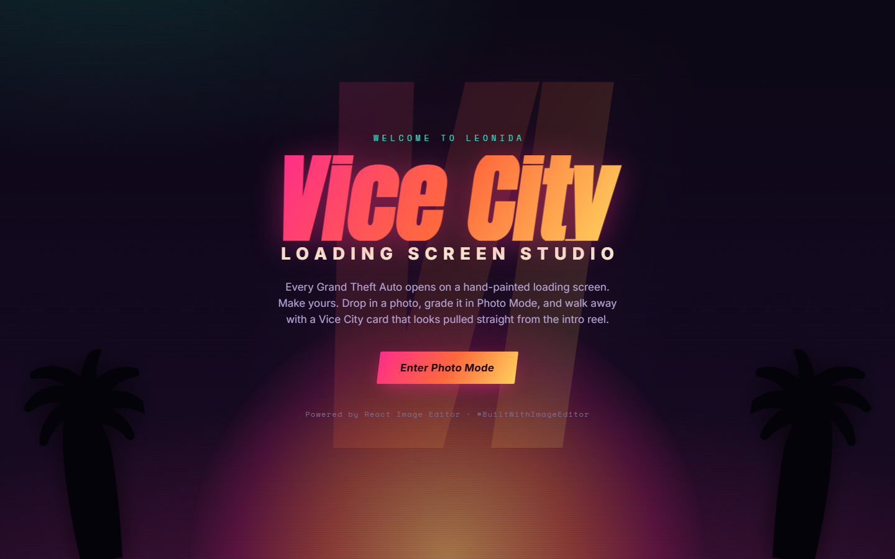

# Vice City · Loading Screen Studio

A GTA VI–inspired experience built for the **#BuiltWithImageEditor** challenge. Every Grand Theft Auto opens on a hand-painted loading screen — this studio lets you make your own. Drop in a photo, edit it in **Photo Mode** (powered by [React Image Editor](https://github.com/unlayer/react-image-editor)), and walk away with a Vice City character card that looks pulled straight from the intro reel.



## The experience

Three stages, one flow:

1. **Leonida** — a neon Vice City title screen. Press *Enter Photo Mode*.
2. **Photo Mode** — the core. Your photo loads into the Unlayer React Image Editor. Crop it, grade it with filters, add text, stickers, or a frame, or draw on it. Fill in a resident dossier alongside: name, hustle (Repo Man, Crypto Guy, Gator Wrangler…), district, wanted level, and a color grade.
3. **Loading screen** — your edited shot is composited into an authentic GTA-style loading card, with the wanted stars, the VI/Leonida mark, your name in the poster type, your hustle, and a loading bar that fills to 100%. Download it, copy it to the clipboard, or share it — the `#BuiltWithImageEditor` caption comes prefilled.

## React Image Editor is the core

The whole app is built around [`@unlayer/react-image-editor`](https://www.npmjs.com/package/@unlayer/react-image-editor):

- The editor **is** Photo Mode — its tools are how you customize your visual. Via `features.imageEditor.tools` the studio exposes exactly the six that serve a portrait — crop, filter, text, stickers, frame, draw — and hides resize and shapes so the panel stays focused.
- Photos come from bundled samples or your own upload (drag any image in via *Upload your photo*).
- `getImage()` flattens the edited canvas into the loading card; the editor's own **Save** button does the same.
- Runs on the editor's `dark` theme to match the Vice City palette, with `onLoad` / `onError` / `onLoadError` wired to the studio's status HUD.

```tsx
<ImageEditor
  ref={editorRef}
  image={image}
  minHeight={560}
  options={{
    theme: 'dark',
    features: {
      imageEditor: {
        tools: { crop: true, filter: true, text: true, stickers: true, frame: true, draw: true, resize: false, shapes: false },
      },
    },
  }}
  onLoad={() => setReady(true)}
  onSave={(r) => onGenerate(r.dataUrl)}
  onLoadError={() => setStatus('That image failed to load.')}
  onError={(err) => setStatus(`Editor error: ${err.message}`)}
/>
```

The generated card grabs the current canvas on demand:

```ts
const dataUrl = editorRef.current?.editor?.getImage();
```

## Tech stack

- [React 19](https://react.dev/) + [TypeScript](https://www.typescriptlang.org/)
- [Vite](https://vite.dev/) for dev/build
- [`@unlayer/react-image-editor`](https://github.com/unlayer/react-image-editor) — the star of the show
- [`html-to-image`](https://github.com/bubkoo/html-to-image) to export the card as a PNG
- Anton / Inter / Space Mono type, a hand-built design system — cool gulf-dusk chrome around one warm, sun-flared card — no UI kit

## Run locally

```sh
npm install
npm run dev      # http://localhost:5173
```

```sh
npm run build    # typecheck + production build to dist/
npm run preview  # serve the production build
```

## Deploy

This is a static Vite SPA — deploy anywhere. On [Vercel](https://vercel.com):

```sh
npm i -g vercel
vercel            # preview deploy
vercel --prod     # production
```

Or import the GitHub repo in the Vercel dashboard; the framework preset and build settings are detected automatically.

## Notes

- Uploaded photos never leave the browser — they are read as data URLs and edited client-side.
- Sample photos are bundled locally so the edited canvas always exports cleanly (no cross-origin taint).
- Respects `prefers-reduced-motion`, keyboard focus, and scales down to mobile.

---

Built with [React Image Editor](https://github.com/unlayer/react-image-editor) by Unlayer. Not affiliated with Rockstar Games — a fan-made tribute to the Vice City aesthetic. **#BuiltWithImageEditor**
